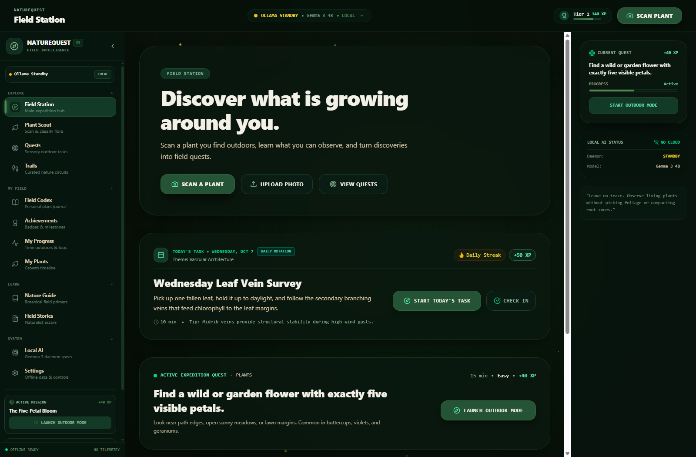
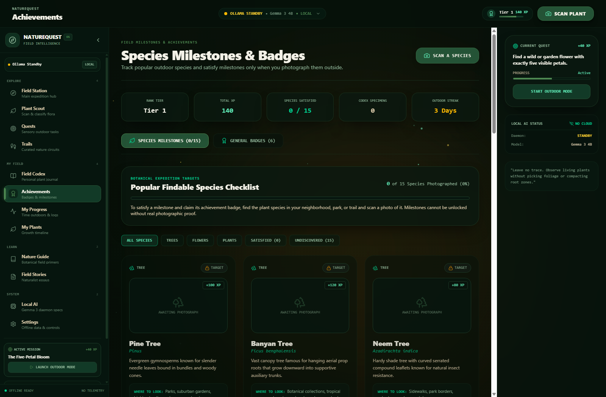
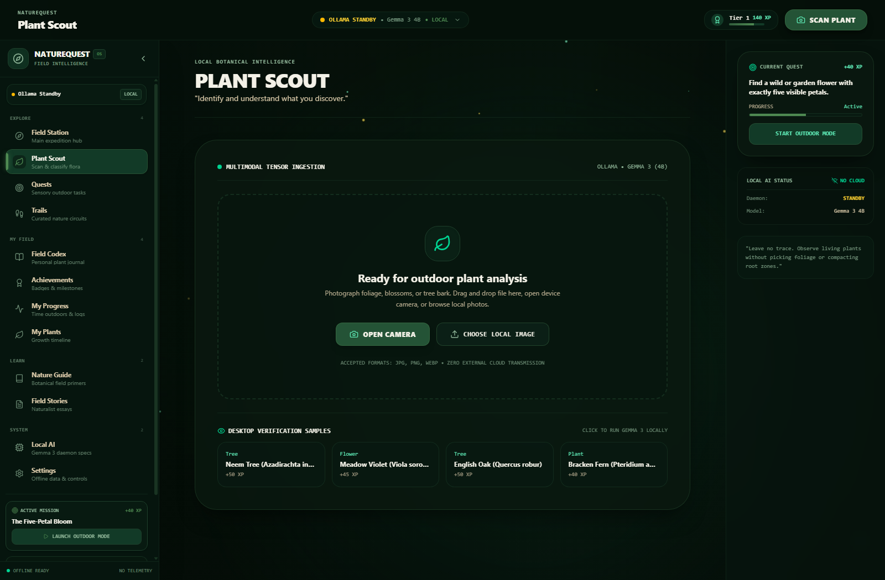
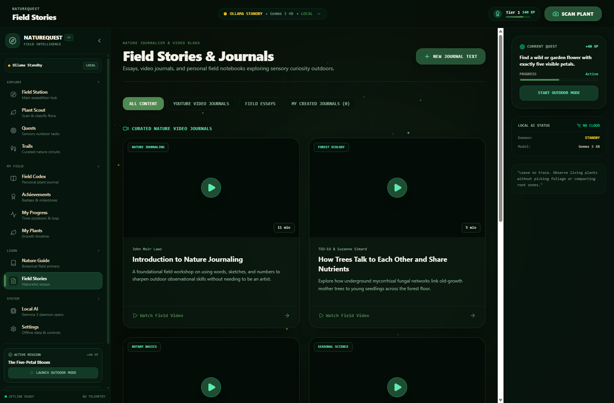
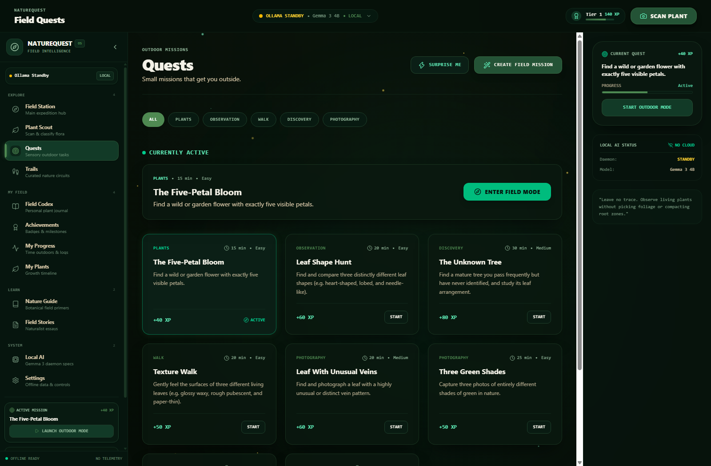

# 🌲 NATUREQUEST
### On-Device Botanical Intelligence & Field Exploration OS

> **Step away from the screen. Explore what grows around you.**

> *Autonomous on-device multimodal AI • Zero cloud telemetry • 100% offline-ready.*

<div align="center">

[](LICENSE)
[-orange.svg)](https://ollama.com/)
[](https://ollama.com/library/gemma3)
[](https://vitejs.dev/)
[](https://tailwindcss.com/)
[](https://motion.dev/)
[
[](#-privacy-first-philosophy)

</div>

---

## 🍃 Table of Contents

<details>
<summary><strong>Explore the README</strong></summary>

- [🍃 Product Overview](#-product-overview)
- [📸 Visual Showcase & Interface Gallery](#-visual-showcase--interface-gallery)
- [🎃 Hacktoberfest 2026 Judge Highlights & Innovations](#-hacktoberfest-2026-judge-highlights--innovations)
- [🌟 Key Features](#-key-features)
  - [1. Plant Scout & Optical Lens](#1-plant-scout--optical-lens)
  - [2. 15 Species Milestone Checklist](#2-15-species-milestone-checklist)
  - [3. Field Station & Daily Expedition Tasks](#3-field-station--daily-expedition-tasks)
  - [4. Sensory Quests & Procedural AI Mission Engine](#4-sensory-quests--procedural-ai-mission-engine)
  - [5. Field Codex & Evolutionary Comparator](#5-field-codex--evolutionary-comparator)
  - [6. My Plants & Growth Timeline Journal](#6-my-plants--growth-timeline-journal)
  - [7. Curated Trails & Interactive Trail Builder](#7-curated-trails--interactive-trail-builder)
  - [8. Field Stories & Video Workshops](#8-field-stories--video-workshops)
  - [9. Achievements & Naturalist Tier Passport](#9-achievements--naturalist-tier-passport)
  - [10. Local AI System Daemon Inspector](#10-local-ai-system-daemon-inspector)
- [🎨 Dynamic UI & React Bits Components](#-dynamic-ui--react-bits-components)
- [🛡️ Enterprise-Grade Security & OWASP Hardening](#-enterprise-grade-security--owasp-hardening)
- [🔒 Privacy-First Architecture](#-privacy-first-architecture)
- [💻 Tech Stack](#-tech-stack)
- [🚀 Quickstart & Installation](#-quickstart--installation)
- [🧭 Field Usage Routine](#-field-usage-routine)
- [📄 License & Naturalist Stewardship](#-license--naturalist-stewardship)

</details>

---

## 🍃 Product Overview

**NatureQuest** is a local-first outdoor exploration operating system designed around botanical classification, sensory nature quests, curated trails, and personal field journaling.

Most digital nature apps require high-speed cellular connections, upload your camera photos to proprietary cloud servers, track continuous GPS coordinates, and keep you glued to your phone screen. When you hike into a national park, walk through deep woodlands, or travel off-grid, cellular connections vanish—and cloud APIs break down.

NatureQuest flips this paradigm entirely:

### 🌿 1. Zero Cloud Telemetry

Every vision inference, plant classification, and sensory challenge is computed strictly on your device using Ollama and Google's **Gemma 3 4B** multimodal neural network.

### 📵 2. Minimal Screen Time

The app is engineered to get you outside, provide observational clues within seconds, issue a physical sensory quest, and encourage you to pocket your device.

### 🌲 3. The Outdoors Is the Product

The screen is only a tool.

**Nature is the experience.**

---

## 📸 Visual Showcase & Interface Gallery

<div align="center">

### 🧭 Field Station — Central Exploration Hub & Daily Rotating Task



### 🎯 Species Milestones — 15 Popular Findable Flora Checklist

*Satisfied with photographic proof.*



</div>

| 🌿 Plant Scout Optical Lens | 🎥 Video Journals & Field Stories |
| :---: | :---: |
|  |  |

<div align="center">

### 🎯 Field Quests & Procedural Mission Engine



</div>

---

## 🎃 Hacktoberfest 2026 Judge Highlights & Innovations

Built specifically for the global open-source community, NatureQuest introduces 5 breakthrough features that highlight technical ingenuity, offline resilience, and interactive botanical pedagogy:

### 🔊 1. Procedural Bio-Acoustic Nature Soundscape Engine

- **100% Offline Audio Synthesis:** Powered entirely by the **Web Audio API** (`AudioContext`, `BiquadFilterNode`, `GainNode`, `OscillatorNode`) without downloading any external MP3 files or audio streams.

- **Parametric Sound Nodes:**

  - **Canopy Wind:** Low-frequency white noise generator shaped through a sweeping lowpass biquad filter and modulated by a sinusoidal Low-Frequency Oscillator (LFO).

  - **Rain Drops:** Brown/pink noise burst emulation filtered through resonant bandpass nodes.

  - **Babbling Brook:** Fluid stochastic pink noise modulated across multi-stage bandpass resonance filters.

  - **Summer Crickets:** Dual high-frequency sine oscillators ($4500\text{ Hz}$ & $4550\text{ Hz}$) modulated at a rapid rhythm simulating biological cicada stridulation.

  - **Morning Songbirds:** Stochastic exponential chirp sweeps generated algorithmically using frequency-ramped sine waves.

- **Interactive Preset Mixer:** Switch instantly between *Canopy Breeze*, *Misty Rainforest*, *Babbling Creek*, and *Summer Dusk*, or adjust individual volume faders in real time.

---

### 🔬 2. Optical Botanical HUD Scanner & Chlorophyll Contrast Filter

- **Interactive Multi-Filter Optics:** Specimen inspector equipped with an SVG reticle crosshair, coordinate tracking, and on-the-fly digital color spectrum filters:

  - **Standard Spectrum:** Natural daylight balanced optical view.

  - **Chlorophyll Contrast:** High-contrast green wavelength isolation filter mimicking laboratory plant health NDVI sensors.

  - **Venation Topology:** Inverted monochrome edge-enhancement filter designed to inspect secondary and tertiary leaf venation architecture.

- **Morphological Diagnostic Stats:** Live telemetry displaying diagnostic bounding boxes, aspect ratios, estimated surface area, and vascular complexity index.

---

### 🌳 3. Phylogenetic Tree of Life — Deep-Time Evolutionary Cladogram

- **Evolutionary Botanical Dendrogram:** Implements the modern **APG IV (Angiosperm Phylogeny Group IV)** taxonomic framework.

- **Lineage Navigation:** Traces plants across geological deep time:

  **Evolutionary Timeline**

```text
PLANTAE
~1.6 Billion Years Ago
        │
        ▼
TRACHEOPHYTES
~430 Million Years Ago
        │
        ├──────────────► GYMNOSPERMS
        │                ~319 Million Years Ago
        │
        └──────────────► ANGIOSPERMS
                         ~135 Million Years Ago

- **Dynamic Specimen Matching:** Automatically correlates the user's recorded Field Codex specimens against evolutionary clades, indicating which ancestral plant families they have verified in the wild.

- **Detailed Clade Dossiers:** Click any node to review geological emergence eras, morphological leaf adaptations, and taxonomic classification.

---

### 📜 4. Archival Naturalist Field Certificate & Archival Dossier

- **Cryptographically Sealed Credential:** Generates an archival botanical diploma with the user's Naturalist Rank Tier, verified species count, day streak, and total outdoor exploration minutes.

- **Offline Integrity Stamp:** Features a unique deterministic verification hash and archival seal guaranteed to require zero cloud sign-off.

- **Print & PDF Export:** Custom `@media print` CSS formats the certificate into an ornate archival parchment document suitable for framing or high-resolution printing.

---

### 🌿 5. Hacktoberfest Community Species Contributor Studio

- **Open-Source Flora Sandbox:** Empowers contributors worldwide to propose new indigenous, regional, and endemic flora to the NatureQuest database.

- **Live JSON Schema Validator:** Validates proposed flora definitions against strict botanical data schemas (`commonName`, `scientificName`, `family`, `nativeHabitat`, `ecologicalRole`, `tactileFeatures`, `naturalistChallenge`).

- **1-Click Pull Request Generator:** Automatically formats valid flora entries into a complete GitHub Pull Request markdown template ready to submit to the repository.

---

## 🌟 Key Features

### 1. Plant Scout & Optical Lens

- **Hardware-Aware Camera Lifecycle:** Mounts your device camera on demand and automatically stops all hardware media tracks the instant you capture a photo, turning off your webcam indicator light immediately.

- **Local Photo Upload:** Drag-and-drop or upload local photographs without triggering camera hardware.

- **Deep Binary Inspection:** Uploaded files undergo asynchronous binary magic-byte inspection (`FF D8 FF`, `89 50 4E 47`, `RIFF/WEBP`), MIME whitelist checks, and path-traversal neutralization.

- **Animated Circular Tensor Engine:** Multi-stage circular processing indicator with stage-by-stage neural tensor progress feedback:

  `01 Optical Normalization → 02 Neural Ingestion → 03 Feature Extraction → 04 Multimodal Cross-Referencing → 05 Taxonomic Verification → 06 Field Report Ready`

- **Botanical Field Dossiers:** Generates detailed diagnostic reports displaying likely common & scientific nomenclature, confidence metrics, visible evidence reasoning (*"Why this match?"*), visual health estimates, next observation steps, and field safety warnings.

---

### 2. 15 Species Milestone Checklist

A curated target checklist designed for outdoor exploration. Milestones are **unlocked only when you provide photographic proof** verified in the wild:

- 🌲 **Pine Tree** (*Pinus*) — Needle leaf clusters and woody cones
- 🌳 **Banyan Tree** (*Ficus benghalensis*) — Aerial prop roots and expansive canopy
- 🌿 **Neem Tree** (*Azadirachta indica*) — Curved serrated compound leaflets
- 🍃 **Peepal / Sacred Fig** (*Ficus religiosa*) — Heart-shaped leaves with distinct drip-tip tails
- 🪵 **Oak Tree** (*Quercus*) — Sinuous leaf lobes and acorn cups
- 🌴 **Palm Tree** (*Arecaceae*) — Columnar trunk and radiating fan/feather fronds
- 🌿 **Wild Fern** (*Pteridophyta*) — Divided feathery fronds and spore clusters
- 🎋 **Bamboo** (*Bambusoideae*) — Segmented hollow culms and arching leaves
- 🌺 **Hibiscus** (*Hibiscus rosa-sinensis*) — Five showy petals with extended pollen column
- 🌼 **Dandelion** (*Taraxacum officinale*) — Sidewalk rosette leaves and composite blooms
- 🌿 **Tulsi / Holy Basil** (*Ocimum tenuiflorum*) — Square aromatic stems and medicinal foliage
- 🪴 **Aloe Vera** (*Aloe barbadensis*) — Thick water-storing succulent blades
- 🌲 **Eucalyptus** (*Eucalyptus*) — Aromatic blue-green sickle leaves and ribbon bark
- 🍁 **Maple Tree** (*Acer*) — Palmate lobed leaves and helicopter samara seeds
- 🌸 **Bougainvillea** (*Bougainvillea spectabilis*) — Vibrant paper-thin petal-like bracts

---

### 3. Field Station & Daily Expedition Tasks

- **Calendar-Synchronized Routines:** Rotates automatically each morning based on local calendar dates.

- **Day-of-Week Focus Themes:**

  - **Sunday:** Canopy Skywatch & Tall Flora
  - **Monday:** Sprout Emergence & Young Shoots
  - **Tuesday:** Living Textures & Tree Bark
  - **Wednesday:** Leaf Vein Architecture & Symmetry
  - **Thursday:** Microhabitat Detective & Mosses
  - **Friday:** Three Greens Color Spectrum
  - **Saturday:** Screenless Wilderness Circuit

- **Bio-Electric Nature Emblem:** An interactive WebGL electric logo on the hero banner with real-time morphing between 🌿 **Flora** (leaf), 🌲 **Arbor** (tree), and 🧭 **Wayfinder** (compass).

- **Consecutive Active Day Streak:** Automatically tracks consecutive outdoor participation days without storing personal identifiers.

---

### 4. Sensory Quests & Procedural AI Mission Engine

- **Tactile & Auditory Challenges:** Sensory missions directing attention to pine scents, rustling canopy sounds, and bark textures.

- **Procedural Mission Generation:** Generate custom, on-demand quests using local Gemma AI based on season, terrain, and sensory mode.

- **Timed Field Mode:** Includes an active stopwatch, preparation checklist, and a **Zen Screen Dimming Mode** that darkens your display so you look at the woods instead of your screen.

- **Photographic Proof Verifier:** Validates mission completion against photographic proof using local vision AI.

---

### 5. Field Codex & Evolutionary Comparator

- **Specimen Journal:** Search, filter, and review every logged plant with high-resolution imagery, discovery timestamps, and taxonomy tags.

- **Comparative Morphological Engine:** Select any two specimens from your codex to compare leaf arrangement, margin structures, vascular venation, ecological niches, and evolutionary differences side-by-side.

---

### 6. My Plants & Growth Timeline Journal

- **Specimen Lifecycle Tracker:** Bookmark specific wild plants or home flora and track their growth across weeks or seasons.

- **Visual Log Entries:** Attach time-stamped follow-up photos and sanitized observation notes to observe seasonal bud breaks, flowering, and leaf drops.

---

### 7. Curated Trails & Interactive Trail Builder

- **Offline Trails Catalog:** Access distance, difficulty, estimated hiking time, terrain classifications, elevation profiles, pack lists, and safety advisories.

- **Custom Trail Builder:** Create and save your own neighborhood walking loops, park circuits, and secret wilderness paths.

---

### 8. Field Stories & Video Workshops

- **Curated Educational Workshops:** High-definition video workshops from master naturalists, including John Muir Laws (*Introduction to Nature Journaling*), Suzanne Simard (*How Trees Talk to Each Other*), CrashCourse Botany (*Meet the Plants*), and MinuteEarth (*Why Leaves Change Color*).

- **Field Essay Writer:** Compose personal outdoor essays with optional AI-assisted botanical polish.

---

### 9. Achievements & Naturalist Tier Passport

- **Tier 1 to 5 Progression:** Earn Bio XP for every plant discovered, milestone completed, and quest accomplished.

- **Badges & Milestones:** Unlock achievements across categories: First Sighting, Arbor Sentinel, Flora Master, Trail Pioneer, and Daily Naturalist.

- **Biodiversity Radar:** Visual distribution metrics detailing flora category variety (Trees, Flowers, Ferns, Succulents, Herbs).

---

### 10. Local AI System Daemon Inspector

- **Real-Time Daemon Telemetry:** Monitors Ollama loopback connectivity at `http://127.0.0.1:11434`, ping latency, active model weights (`gemma3:4b`), and GPU tensor offload readiness.

- **Zero-Cloud Guarantees:** Instant visual indicator confirming that 0 bytes of external network transmission are occurring.

---

## 🎨 Dynamic UI & React Bits Components

NatureQuest combines high-performance web graphics and reactive animations:

| Component | Source / Engine | Implementation in NatureQuest |
|---|:---:|---|
| **`<ElectricLogo />`** | WebGL / `ogl` | Rendered in the Field Station hero banner & Plant Scout scanner. Features high-voltage electric filaments, interactive cursor charge, click shockwave ripples, and real-time morphing across 3 custom botanical SVGs (`nature-leaf.svg`, `nature-tree.svg`, `nature-compass.svg`). |
| **`<RotatingText />`** | `motion/react` | Embedded into every sidebar navigation item (`Field Station`, `Plant Scout`, `Codex`, etc.) with character-by-character stagger, spring dampening, and rhythmic interval offsets. |
| **`<TrueFocus />`** | `motion/react` | Applied to primary optical trigger buttons (*"SCAN THE PLANT"*) across the TopNav, Sidebar, and Hero cards with animated glowing borders and focus blur. |
| **`<MaskedHeading />`** | `gsap` | Dominates the Field Station hero section, masking cinematic sunlit canopy photography through dynamic, responsive typography with rise-and-wipe entrance physics. |
| **`<ParticleText />`** | HTML5 Canvas | Powers the top navigation brand header with interactive particle dispersal and cursor repel physics alongside the live Ollama status indicator. |
| **Bioluminescent Atmosphere** | CSS & Canvas | Multi-layer ambient background with sinusoidal pollen spores, Ken Burns wilderness slow-zoom, canopy God-rays, drifting mist, and custom emerald glow utilities (`.glow-text-emerald`, `.glow-text-mint`). |

---

## 🛡️ Enterprise-Grade Security & OWASP Hardening

NatureQuest has been audited and secured against modern web vulnerabilities and the OWASP Top 10 checklist:

```text
[Incoming Request / Upload]
        │
        ├──► 1. Content Security Policy (CSP) & Security Meta Headers
        │
        ├──► 2. MIME & Extension Whitelist (JPG, PNG, WEBP)
        │
        ├──► 3. Binary Magic Bytes Validation (FF D8 FF / 89 50 4E 47 / RIFF..WEBP)
        │
        ├──► 4. Path Traversal & Null Byte Sanitization (../, ..\, \0)
        │
        ├──► 5. Sliding-Window Rate Limiter (Denial-of-Service / Inference Flooding Defense)
        │
        ├──► 6. Input Sanitization (XSS & Script Tag Stripping)
        │
        ▼
[Local Ollama Multimodal Daemon (127.0.0.1:11434)] ──► Zero External Egress